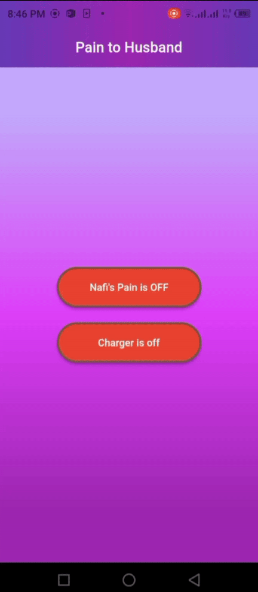

# Remotely App Controlled IoT Device with ESP8266 and Flutter

## Project Overview

This GitHub repository contains the source code for an Internet of Things (IoT) device built using the ESP8266 microcontroller and a Flutter app for remote control. The project was created to solve a unique problem for my client. The client lives 400km away from his wife, who wants to keep an eye on him at all times, even at night he needs to keep the lights on. However, the client has trouble sleeping with the lights on. To address this issue, I designed an IoT solution that allows the client's wife to remotely control the lights and even manage the phone charger through a mobile app.

## Features

### 1. Remote Light Control
- The IoT device can remotely control the lights in the client's location.
- The Flutter app enables the client's wife to turn the lights on or off at any time.

### 2. Phone Charger Management
- The IoT device can also remotely control the phone charger.
- The app allows for manual control, allowing the user to turn the charger on or off as needed.
- Additionally, the charger will automatically turn off when the battery charge level is above 95% and automatically turn on when it falls below 50%.

## Technologies Used

- **Frontend**: Flutter
- **Backend**: Firebase

## Demo

### Remote Light Control

### Phone Charger Management

